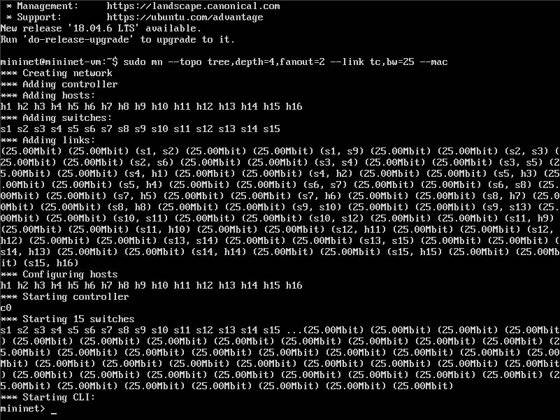
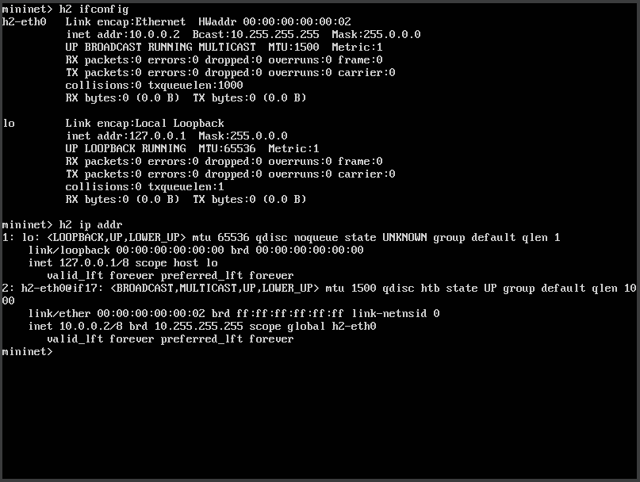
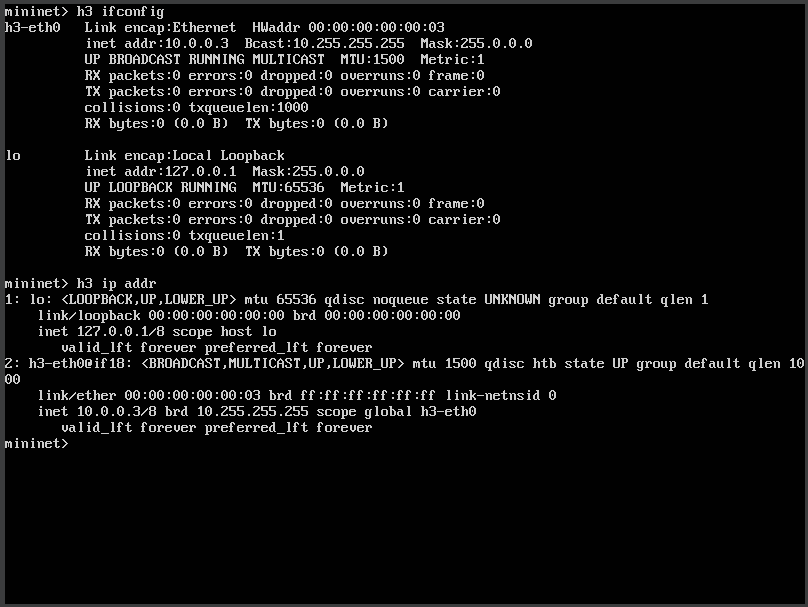
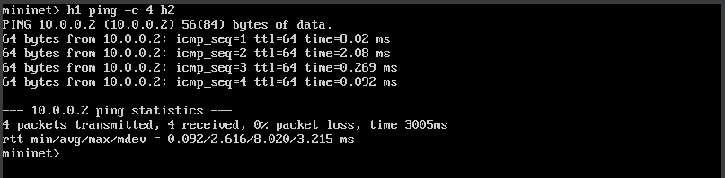
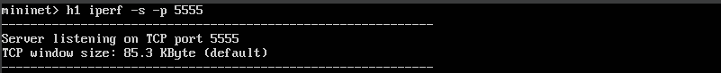
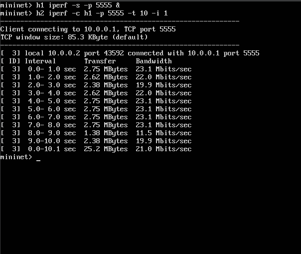

# Trabalho Mininet

Este trabalho envolve a criação de uma topologia de rede no Mininet, incluindo a execução de testes de ping entre hosts e a realização de testes de largura de banda utilizando o `iperf`. A seguir os passos realizados e capturas de tela que documentam o processo.

## Passos Realizados

### 1. Criação da Topologia
A topologia foi criada utilizando o comando abaixo, com uma profundidade de 4 e ramificação de 2. A largura de banda foi definida como 25 Mbps entre os nós, e os endereços MAC foram padronizados.

```bash
sudo mn --topo tree,depth=4,fanout=2 --link tc,bw=25 --mac
```


### 2. Informações de Interface, MAC e IP
Para inspecionar as informações das interfaces de rede, endereços MAC e IP dos hosts, os seguintes comandos foram utilizados:

### Host 1:
```bash
h1 ifconfig
h1 ip addr
```


### Host 2:
```bash
h2 ifconfig
h2 ip addr
```


### Host 3:
```bash
h3 ifconfig
h3 ip addr
```


### 3. Teste de Conectividade - Ping
Realizou-se um teste de ping entre os hosts `h1` e `h2` para verificar a conectividade na rede.
```bash
h1 ping -c 4 h2
```


### 4. Execução de Testes de Largura de Banda com iperf
O `iperf` foi configurado para medir a largura de banda entre os hosts. O host `h1` foi configurado como servidor TCP na porta 5555, e o host `h2` foi configurado como cliente para realizar o teste.

#### Host 1 como Servidor:
```bash
h1 iperf -s -p 5555
```


#### Host 2 como Cliente:
```bash
h2 iperf -c h1 -p 5555 -t 10 -i 1
```


### Colaboradores
 - Victor Boaventura Souza Muniz
- Igor Nogueira Olivio
